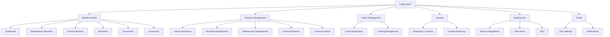

```mermaid
graph TD
A[Login/Home] --> B[Resident Portal]
A --> C[Property Management]
A --> D[Visitor Management]

    B --> B1[Dashboard]
    B --> B2[Maintenance Requests]
    B --> B3[Amenity Booking]
    B --> B4[Payments]
    B --> B5[Documents]
    B --> B6[Community]

    C --> C1[Admin Dashboard]
    C --> C2[Resident Management]
    C --> C3[Maintenance Management]
    C --> C4[Financial Reports]
    C --> C5[Communications]

    D --> D1[Guest Registration]
    D --> D2[Parking Management]

    A --> E[Security]
    E --> E1[Emergency Contacts]
    E --> E2[Incident Reporting]

    A --> F[Building Info]
    F --> F1[Rules & Regulations]
    F --> F2[Floor Plans]
    F --> F3[FAQ]

    A --> G[Profile]
    G --> G1[User Settings]
    G --> G2[Notifications]
```
